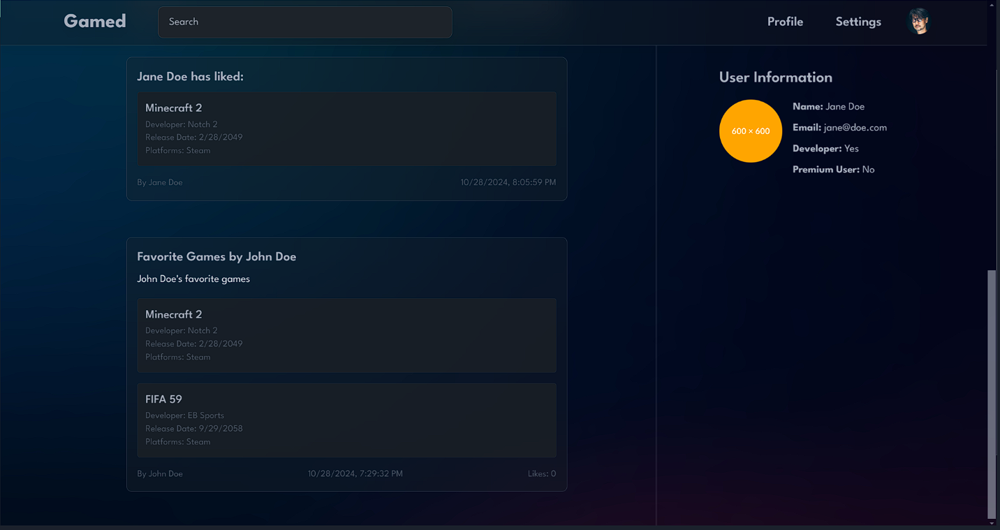

### Team 65

# Gamed
A social game curation platform.

## Description
Gamed is a curated, community-driven platform specifically designed for video gamers to enhance discovery and engagement. This platform offers several features:

- Granular Game Ratings: Users can rate games across multiple metrics (e.g., graphics, music, gameplay enjoyment) through a nuanced rating system that tracks player enjoyment across different parts or acts of a game. This adds depth to traditional rating systems and provides more detailed feedback.
- Personalized Recommendations: By curating game lists and analyzing shared preferences, the platform can generate personalized game recommendations, similar to how Spotify creates music playlists. This allows players to discover new games based on others with similar tastes.
- Social Interaction and Community Engagement: Gamed encourages users to curate and share their favorite game lists, compare preferences, and engage with others. This fosters a deeper sense of community and personalized discovery through social interaction.

Gamed is designed to provide a personalized and social gaming experience. Users can discover new games based on similar player preferences, offer detailed feedback on different aspects of a game, and creatively share their gaming tastes in a meaningful way.

## Installation
1. Clone the project via Gitlab:

    `git clone git@gitlab.ewi.tudelft.nl:cs4505/2024-2025/teams/team-65.git`

2. Or download the source files from the available releases

## Usage
This project requires docker to be installed. You can do so via the command line:

1. Debian/Ubuntu
     
    `sudo apt-get install docker`
2. MacOS
    
    `brew install docker`

Currently, the project contains nine microservices. Seven are fully working, while two, the recommender and review writer services, only
contain placeholder spring boot services. 

The three microservices without databases (`Timeline`, `UserPage`, and `Search`) are started
by running the ServiceApplication classes. They are held in each of these services' module in the `src.main.java.org.gamed.<service_name>` package. 

The three microservices holding databases (`GameListDatabase`, `UserDatabase`, and `ReviewDatabase`) are dockerized. You can start any dockerized microservice by heading in the service's module and running:

    mvn clean package
    docker compose up

If anything fails while running `docker compose up`, rerun the command and everything will work.

Remember to close the images by using: 

    docker compose down

Lastly, the frontend service is started by running `npm run build` and then `npm run dev`. This opens up a connection to `localhost:5173`.

To use the user interface, after starting all microservices and the frontend application, navigate to `localhost:5173`. From there,
create a new user, and then you will be able to navigate the application. Performing any actions (such as following a user or liking a game)
must be done by sending requests through Postman. The list of possible requests is presented in the [API Gateway](#api-gateway) section.

## Visuals

We present a screenshot of the timeline the user that was logged in had. As the user follows 2 other users, John and Jane Doe, their activity
is displayed on our timeline. In this case, it is Jane liking a game, Minecraft 2, and a game list that John had created. When John created
the list, he added 2 games to it, Minecraft 2 and FIFA 59. The top bar allows searching for games through the search bar, going to your
user page by clicking on `Profile`, and going back to the timeline by clicking on `Gamed`. Clicking on a post will show you shortly information
about the user that had the recent activity. Clicking on the top right icon allows you to log out. Logging out will prompt you back to a login page. 
Lastly, for ease of use and accessibility, the top bar is displayed on all pages of Gamed.

## Microservices
To implement Gamed, we chose to follow a Microservices architecture. To this end, for our proof of concept we have implemented 6 microservices.
Out of them, 3 microservices contain the logic for our databases, while the other 3 contain the logic for the different components on
our user interface. They all include the logic for allowing communication between them, and the 3 microservices with no databases also
include logic for communicating with the frontend. We list them below:

`User Database Microservice` - holds a repository for all users and the databases for user interactions (following a user or a list, liking a list, post, or game);

`Game-List Database Microservice` - holds a different repository for games, game lists, and tags, and different repositories for the games in lists, as well, as the tags associated with games or lists;

`Review Database Microservice` - holds a different repository for reviews, ratings, and comments;

`Timeline Microservice` - requests the necessary information to correctly display the timeline of the logged user in the user interface; this
represents showing new activity from users or lists they follow;

`User Page Microservice` - requests the necessary information to correctly display the user page of a user; this represents showing
followers, followed users and lists, liked lists and games, the user's own created lists, and the user's playtime on their games;

`Search Microservice` - handles searching for games in the user interface through the search box, situated in the top bar of any page of
Gamed's user interface.

## Conducted Experiments
We have conducted 2 experiments regarding our key quality choices, to ensure the proof of concept satisfies them. They allow us to 
assert the system is working correctly and adheres to the principles of the architecture we have chosen, microservices.

### Experiment 1: Testability
Through this experiment, we ensure both that our application can be tested and that it works as intended. This also lets the user know
the system works correctly, and therefore can use the application without problems.

We conducted this experiment by fully testing the microservices holding databases, as the core functionality is dispersed throughout repositories,
services, and controllers. As such, we wanted to fully test all of them. For the microservices that do not hold databases, the core functionality
was only in the service classes. The controllers only have one endpoint that makes use only of the service classes and as such, we only
tested the service classes. The entities and DTOs are trivial to test, and as such were left out. One can observe the coverage of our tests
by heading into the respective module of a microservice, and then navigating to the `test` package. Then, the person can choose to `run tests
with coverage`, revealing the coverage of the classes.

### Experiment 2: Modularity
Through this experiment, we prove that our microservices architecture is valid and that it adheres to the principles of a correct microservices
architecture. It aims to show that one failing service will not cause the whole application to fail. Upon restart, it will correctly display data, including any updates made by other active microservices during its downtime.

To conduct this experiment, we followed these steps:
1) We started logged in as an existing user which already had other users that they followed. Since they follow other users, the activity of those other users is displayed on our timeline.
2) We then closed the timeline service and observed the rest of the application. It functioned perfectly, and the only unresponsive component of the UI was the timeline.
3) We then sent a request through another microservice that had one of the followed users like a game. Since they had just liked it, refreshing the timeline to update it would show us the new activity at the top.
4) We then verified this happens correctly by restarting the timeline microservice. It had correctly displayed the new data, and no errors took place when restarting it. The rest of the application continued to function without problems.

## API Gateway
`GameListDatabaseService`
- Game Controller
  - 8092/games/create (POST)
  - 8092/games/update/{gameId} (PUT)
  - 8092/games/{gameId} (GET)
  - 8092/games/all (GET)
  - 8092/games/search/{query} (GET)
  - 8092/games/delete/{gameId} (DELETE)
- Game Lists Controller
  - 8092/lists/create (POST) 
  - 8092/lists/update/{listId} (PUT)
  - 8092/lists/{listId} (GET) 
  - 8092/lists/delete/{listId} (DELETE) 
  - 8092/lists/user/{userId} (GET) 
  - 8092/lists/all (GET) 
- Game to Tag Controller
  - 8092/gameToTags/create (POST)
  - 8092/gameToTags/{gameToTagId} (GET)
  - 8092/gameToTags/all (GET) 
  - 8092/gameToTags/delete/{gameToTagId} (DELETE)
- List to Game Controller
  - 8092/listToGames/create (POST) 
  - 8092/listToGames/{listToGameId} (GET)
  - 8092/listToGames/all (GET) 
  - 8092/listToGames/delete/{listToGameId} (DELETE)
  - 8092/listToGames/list/{listId} (GET)
- List to Tag Controller
  - 8092/listToTags/create (POST) 
  - 8092/listToTags/{listToTagId} (GET)
  - 8092/listToTags/all (GET) 
  - 8092/listToTags/delete/{listToTagId} (DELETE)
- Tags Controller
  - 8092/tags/create (POST)
  - 8092/tags/{tagId} (GET)
  - 8092/tags/all (GET) 
  - 8092/tags/delete/{tagId} (DELETE) 

`UserDatabaseService`
- User Controller
  - 8090/users/create (POST)
  - 8090/users/update/{userId} (PUT)
  - 8090/users/{userId} (GET)
  - 8090/users/all (GET)
  - 8090/users/delete/{userId} (DELETE)
- User to Followed List Controller
  - 8090/user/followed-lists/follow (POST)
  - 8090/user/followed-lists/unfollow (DELETE)
  - 8090/user/followed-lists/{userId}/following (GET)
  - 8090/user/followed-lists/{listId}/followers (GET)
  - 8090/user/followed-lists/is-following (GET)
- User to Followed User Controller
  - 8090/user/followed-users/follow (POST)
  - 8090/user/followed-users/unfollow (DELETE)
  - 8090/user/followed-users/{userId}/following (GET)
  - 8090/user/followed-users/{userId}/followers (GET)
  - 8090/user/followed-users/is-following (GET)
- User to Like Controller
  - 8090/user/likes/like (POST)
  - 8090/user/likes/unlike (DELETE)
  - 8090/user/likes/{userId}/liked-items (GET)
  - 8090/user/likes/{itemId}/likers (GET)
  - 8090/user/likes/is-liking (GET)
- User to Playtime Controller
  - 8090/user/playtime/record (POST)
  - 8090/user/playtime/update (PUT) 
  - 8090/user/playtime/{userId}/game/{gameId} (GET)
  - 8090/user/playtime/{userId}/records (GET)
  - 8090/user/playtime/delete (DELETE)

`ReviewDatabaseService`
- Comment Controller
  - 8091/comments/create (POST)
  - 8091/comments/update/{commentId} (PUT)
  - 8091/comments/{commentId} (GET)
  - 8091/comments/all/{parentId} (GET) - parentId is either the ID of a review or a user
  - 8091/comments/delete/{commentId}
- Rating Controller
  - 8091/ratings/create/{reviewId} (POST)
  - 8091/ratings/update/{ratingId} (PUT)
  - 8091/ratings/{ratingId} (GET) 
  - 8091/ratings/review/{reviewId} (GET) 
  - 8091/ratings/delete/{ratingId} (DELETE)
- Review Controller
  - 8091/reviews/create (POST)
  - 8091/reviews/update/{reviewId} (PUT)
  - 8091/reviews/{reviewId} (GET)
  - 8091/reviews/game/{gameId} (GET)
  - 8091/reviews/user/{userId} (GET)
  - 8091/reviews/delete/{reviewId} (DELETE)

`UserPageService`
  - User Page Controller
    - 8084/user_page/{userId} (GET)

`TimelineService`
  - FrontEnd Controller
    - 8083/home/{userId} (GET)

`SearchService`
  - FrontEnd Controller
    - 8082/search/{query} (GET)

## Contributing
We are open to any suggestions you might have on the functionality or code of Gamed, however at this time we will not be accepting any third-party commits on our repo.

## Authors and acknowledgment
Software Architecture (CS4505), 2024/2025, Delft University of Technology

Team 65 (Supervised by Tushar Kumar):
- Andrei Ionescu
- Konrad Barbers
- Matei Ivan
- Stefan Stoicescu

